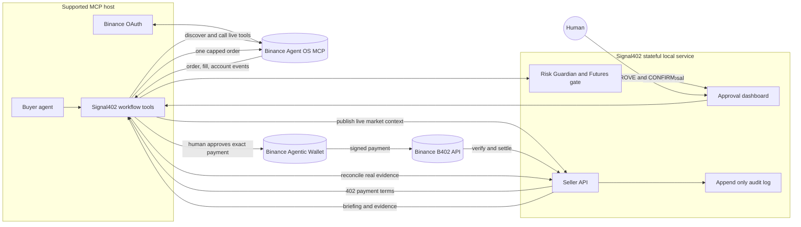

# Signal402

[](https://github.com/Teecash96/Signal402/actions/workflows/ci.yml) [](./LICENSE)

Signal402 is a real Binance Agent OS agent. A Seller Agent sells a live, evidence backed briefing through Binance B402 x402. A Buyer Agent pays with the Binance Agentic Wallet, reads its Agentic subaccount through a supported Binance MCP host, and can submit one real Spot `MARKET BUY` only after the risk gate, dashboard `APPROVE`, and final execution checks pass.

There are no simulated payments, receipts, balances, fills, or order IDs.

## Problem

Agents can read a price, but a price alone is not a trading decision. A useful agent workflow must also answer four questions:

1. What evidence produced this recommendation?
2. Did the buyer receive the exact report it paid for?
3. Is the proposed order covered by the live account balance and risk rules?
4. Did Binance actually accept and fill the order?

Signal402 connects those answers into one auditable path. It sells a timestamped interpretation of live Binance data, gates the proposal with deterministic Spot and Futures rules, requires a human approval before every write, and records only payment and order evidence returned by Binance. It is a decision and execution control layer, not a profit promise.

## Architecture

The supported MCP host owns Binance OAuth and runtime tool discovery. Signal402 owns the marketplace contract, B402 challenge handling, risk envelope, dashboard approval, and redacted audit trail.



### Trust boundaries

| Component | Responsibility | Never does |
| --- | --- | --- |
| Supported MCP host | Binance OAuth, runtime tool discovery, live account reads, and order calls | Invent tool names or use public REST for account data |
| Signal402 Seller | Briefing access, payment verification, risk state, approval state, and audit records | Hold Binance OAuth tokens or issue fake payment and order evidence |
| Binance Agentic Wallet | Signs an approved B402 payment | Approve a trade or place a Binance order |
| Browser dashboard | Shows state and records human approval | Receive API keys, OAuth tokens, or wallet credentials |
| Binance | Source of truth for market, account, payment settlement, orders, and fills | Guarantee a risk estimate or a profit |

## Repository map

| Path | Purpose |
| --- | --- |
| [`src/agent/server.ts`](./src/agent/server.ts) | Signal402 MCP tools and the mandatory workflow |
| [`src/seller/index.ts`](./src/seller/index.ts) | Stateful Seller API, dashboard, approval routes, and health check |
| [`src/lib/binanceMcp.ts`](./src/lib/binanceMcp.ts) | Optional approved direct MCP client and encrypted token cache. Supported host mode remains the default |
| [`src/lib/binanceX402.ts`](./src/lib/binanceX402.ts) | Real Binance B402 seller verification and settlement |
| [`src/lib/binanceX402Client.ts`](./src/lib/binanceX402Client.ts) | Real Agentic Wallet x402 payment client |
| [`src/lib/futuresRisk.ts`](./src/lib/futuresRisk.ts) | Pure deterministic DeltaZero based Futures risk envelope |
| [`src/lib/executionPlan.ts`](./src/lib/executionPlan.ts) | Hash bound, 60 second, single use execution plans |
| [`src/lib/executionReceipt.ts`](./src/lib/executionReceipt.ts) | Ordered hash verified payment and order evidence |
| [`src/lib/riskState.ts`](./src/lib/riskState.ts) | Persistent kill switch and equity drawdown state |
| [`src/lib/carryEconomics.ts`](./src/lib/carryEconomics.ts) | Binance CEX Spot and Futures carry report, report only |
| [`src/buyer/riskGuardian.ts`](./src/buyer/riskGuardian.ts) | Live USDT balance gate for Spot proposals |
| [`.agents/skills/signal402-binance/`](./.agents/skills/signal402-binance/) | Reusable Agent Skills contract for real Binance operation |
| [`test/`](./test/) | Deterministic risk, schema, security, payment, and fill proof tests |
| [`web/`](./web/) | Safe public Vercel front door with no account data |
| [`SIGNAL402_AGENT.md`](./SIGNAL402_AGENT.md) | Host contract and exact tool sequence |

## What the buyer pays for

Signal402 does not sell a raw ticker wrapper. It sells a verified market intelligence artifact for a requested symbol. After real B402 settlement, the Seller returns the live Binance snapshot plus an explainable screening result:

1. Direction from the 24 hour move.
2. Risk tier from momentum and the observed 24 hour range.
3. Confidence based on the completeness of the live snapshot.
4. A deterministic `BUY_SMALL` or `WAIT` action.
5. The thesis and the rule that invalidates the result.

The action is not a profit promise. `BUY_SMALL` only permits the next safety checks. `WAIT` blocks proposal creation. The Buyer still reads the live Agentic subaccount, applies Risk Guardian, and waits for dashboard approval. This is the reason for the 0.01 USDC payment: the Buyer pays for an independently produced, timestamped interpretation rather than free price access.

The screening rules are visible and deterministic. A move of at least 1 percent is bullish, a move of at most negative 1 percent is bearish, and high risk starts at an absolute move of 8 percent or a 24 hour range of 12 percent. Only bullish, non high risk snapshots produce `BUY_SMALL`.

Signal402 also publishes a Binance CEX carry report when the host supplies both Spot and Futures market inputs. It shows basis, signed funding carry, round trip fees, spread, slippage, net expected carry, and a break even estimate. It is a transparent research artifact. It is always `reportOnly` and cannot submit a Spot and Futures hedge.

## Public frontend and live console

The repository includes a small public Vercel front door in [`web/`](./web/). It explains the workflow and its hard boundaries without exposing credentials, balances, payment data, or fake market values. The live operator console is the Express app at `http://localhost:3001` because its authenticated approval state, Binance OAuth host connection, and audit trail must remain on a stateful agent host. A Vercel static deployment is therefore a product entry point, not a claim that Vercel is executing trades.

Open the deployed public front door at [signal402-three.vercel.app](https://signal402-three.vercel.app/). It is intentionally informational. Do not enter Binance credentials or payment secrets into it.

The local console uses a compact execution control room layout. It keeps MCP state, data source, access mode, risk status, approval, order evidence, and the Futures event trail visible. A `MCP: FALLBACK` label means the optional public REST source is active. It never means that Binance account or order data came from the fallback.

## Temporary free access

If B402 merchant onboarding is not available yet, set `SIGNAL402_FREE_ACCESS=true` in `.env`. The Seller then returns the live briefing without requesting payment. The response has no receipt and the dashboard shows `ACCESS: FREE`. This mode does not create a fake receipt and does not weaken live Binance MCP data, Risk Guardian, dashboard approval, the 10 USDT order cap, or audit logging. Paid B402 mode remains the default. Never describe a free briefing as a settled B402 payment.

## Run with your own account

The Binance MCP account and the B402 wallet are different Binance products. The Spot order uses the Binance Agentic subaccount. The x402 payment uses the Binance Agentic Wallet on BSC. Fund both with small amounts before using production funds.

### Preflight

| Check | Required state |
| --- | --- |
| Node.js | Node 22 or newer |
| Binance MCP | Official `https://agent.binance.com/mcp/agentic` server connected in a supported host |
| Binance scopes | Market data, Account, and Trade only. No transfer or withdrawal scope |
| Seller | Running locally with a long random `SIGNAL402_HOST_TOKEN` |
| Dashboard | Password hash and session secret configured |
| Spot funds | Agentic subaccount has enough USDT for the capped order and fees |
| Paid access | B402 merchant credentials and Agentic Wallet CLI configured |
| Free access | `SIGNAL402_FREE_ACCESS=true` only when B402 onboarding is unavailable |

The free path is useful for validating live MCP data and the risk gate. It is not evidence of a settled B402 payment. Use paid mode for marketplace settlement evidence.

1. Clone and install.

   ```sh
   git clone https://github.com/Teecash96/Signal402.git
   cd Signal402
   npm install
   cp .env.example .env
   ```

2. Generate a local bridge token and put the same value in `.env` as `SIGNAL402_HOST_TOKEN`.

   ```sh
   export SIGNAL402_HOST_TOKEN=$(openssl rand -hex 32)
   ```

   Copy the printed value into the `SIGNAL402_HOST_TOKEN` line in `.env`.

3. Create the dashboard password hash without putting the password in shell history.

   ```sh
   npm run hash:dashboard-password
   ```

   Copy the printed `SIGNAL402_DASHBOARD_PASSWORD_HASH` line into `.env`. The helper prints shell quotes around the scrypt value so its `$` separators stay intact. Set `SIGNAL402_DASHBOARD_SESSION_SECRET` and `MCP_TOKEN_ENCRYPTION_KEY` to separate random values. The dashboard approval route has a server side session, secure cookie settings, a five failure login limit, and a honeypot. Set the optional Cloudflare Turnstile keys to add challenge verification. Do not run `source .env`; the application loads `.env` itself.

4. Apply for Binance B402 merchant credentials. Binance provides the production base URL, `clientId`, and `accessToken` after onboarding. Generate the RSA key pair locally, submit only the public key, keep the private key locally, and set a seller BSC address in `B402_PAY_TO`. This repository refuses to issue a fake challenge when these values are missing. If onboarding is unavailable, use the temporary free access mode above.

5. For paid mode, install and log in to the Binance Agentic Wallet CLI. The executable must be available as `baw`, or set `BINANCE_AGENTIC_WALLET_BIN` to its path. The payment tool uses the documented `baw x402-payment preview` and `baw x402-payment sign` commands. You can skip this step while temporary free access is enabled.

6. Start the Seller.

   ```sh
   npm run start:seller
   ```

   The Seller does not authenticate to Binance in host mode. The supported MCP host performs Binance login and asks for Market data, Account, and Trade scopes for the Agentic subaccount. Do not grant a transfer scope. Binance Agent OS does not provide a withdrawal scope.

7. Add two MCP servers to a supported host such as Codex Desktop, Codex CLI, Claude, Cursor, or ChatGPT. Binance owns the OAuth flow. Signal402 does not open a custom OAuth page or store Binance tokens.

   Binance MCP:

   ```sh
   codex mcp add binance-mcp-server --url https://agent.binance.com/mcp/agentic
   ```

   Signal402 MCP, from the repository directory:

   ```sh
   codex mcp add signal402-agent --env SIGNAL402_HOST_TOKEN=$SIGNAL402_HOST_TOKEN --env SELLER_ENDPOINT_URL=http://localhost:3001 -- npx tsx "$PWD/src/agent/server.ts"
   ```

   In supported host mode, the MCP host is the Buyer. Do not also run `npm run start:buyer`; that legacy standalone process is not part of the host workflow.

8. Open [http://localhost:3001](http://localhost:3001). Sign in with the dashboard password. The header must show `MCP: LIVE` after the host publishes a live ticker. `DATA: FALLBACK` is allowed only when `ALLOW_PUBLIC_REST_FALLBACK=true` and is clearly labelled.

9. Fund the Agentic subaccount with USDT using the Binance web UI. The documented path is Profile, Dashboard, Subaccount, Asset Management, Transfer. Keep at least 10 USDT available for the capped Spot order.

10. In the supported host, call `signal402_get_workflow` and follow the returned workflow. The host discovers Binance tool names at runtime, publishes the live market snapshot, pays the real 0.01 USDC challenge after human confirmation in paid mode, or continues without payment in free mode. It stops when the Seller returns `WAIT`, or creates the proposal when the Seller returns `BUY_SMALL`. It then waits for the dashboard `APPROVE`, submits one real MARKET BUY capped at 10 USDT, reads the real fill and balances, and records the receipt only in paid mode.

The full agent contract is in [`SIGNAL402_AGENT.md`](./SIGNAL402_AGENT.md). Load it in the supported host before enabling trading.

## Binance Futures mode

Spot is the default. Set `FUTURES_SYMBOL` and use the Futures branch in `SIGNAL402_AGENT.md` only when you have deliberately funded the matching Binance Agentic Futures wallet.

For a deliberate USD M directional run, set `SIGNAL402_MARKET_TYPE=USD_M`, keep `SIGNAL402_FUTURES_MODE=directional`, and publish a fresh context through `signal402_publish_futures_context`. For neutral analysis set `SIGNAL402_FUTURES_MODE=neutral`; the server will keep it report only. The context values, not an environment variable, are the source of truth for the risk proof.

Signal402 supports two contract types:

1. `USD_M` uses USDT collateral. Directional analysis can submit one real order when every gate passes.
2. `COIN_M` uses coin collateral. It is report only in this version. No COIN M order write is accepted.

There are two analysis modes:

1. `directional` evaluates one long or short intent. A USD M opening order also needs a declared protective stop plan exposed by the live host.
2. `neutral` measures long and short imbalance and returns a hedge ratio. It is report only. Signal402 never submits two hedge legs automatically.

The Futures risk envelope is deterministic and versioned. It records the input hash, output hash, evidence tool names, decision, risk zone, margin required, margin utilization, funding exposure, spread, slippage, liquidation distance, and invalidation rule. It refuses stale data older than 15 seconds, cross margin, leverage above 3x, unverified exchange filters, missing funding or liquidation data, spread or slippage above 50 basis points, absolute funding above 5 basis points per interval, liquidation distance below 10 percent, insufficient available margin, and a combined notional above 10 USDT. The cap applies to the projected exposure. A reduce only order may lower an existing exposure.

The host sends funding as `fundingRateBps`, in basis points for one funding interval. It also sends `nextFundingTime`. Signal402 does not convert an unknown unit or guess a missing interval. After dashboard approval, the host must re-read the account and market data and call `signal402_revalidate_futures_context`; a stale or changed context cancels the execution path.

Signal402 requires isolated margin and reads the existing leverage. It never changes leverage, margin mode, or position mode automatically. Futures orders use an explicit symbol, side, position side, quantity, and `reduceOnly` value. `quoteOrderQty` is never sent. Every directional USD M order needs dashboard `APPROVE` and a separate `CONFIRM` step. The host then submits one live MARKET order through its runtime discovered Binance Futures MCP tool and records authenticated order and account events. The dashboard shows the receipt, order ID, fill, position, margin, and event timeline only when those values came from Binance.

The risk envelope is a risk estimate, not a guaranteed loss limit. Liquidation, fees, funding changes, latency, and exchange execution can produce a different result. Keep the Agentic Futures wallet funded only with an amount you can lose, and use Binance's emergency stop if needed.

The implementation follows the [Binance Agent OS agentic MCP documentation](https://developers.binance.com/en/docs/agent-native/mcp-server/agentic) and records the authenticated order and account events described by [Binance Futures user data streams](https://developers.binance.com/en/docs/products/derivatives-trading-coin-futures/user-data-streams).

## Supported host architecture

Binance Agent OS currently authorizes approved AI hosts. Signal402 therefore runs as a local MCP server beside the official Binance MCP server. The host owns Binance OAuth and calls both servers. Signal402 owns the marketplace state, x402 payment flow, Risk Guardian, dashboard approval gate, and append only audit log.

The host bridge accepts only live market data and fill records that identify their Binance MCP source. When publishing Spot data, pass the complete runtime discovered Binance tool list, including the balance and order tools that may be used after approval. It rejects missing runtime tool names, invalid balances, missing order fields, fills before dashboard approval, and amounts above the hard 10 USDT cap. Signal402 never accepts a simulated receipt.

Every eligible proposal also receives a 60 second execution plan. The plan binds the exact symbol, side, quantity, notional, position side, reduce only value, existing leverage, margin mode, source hashes, payment receipt, and expiry. A plan can be approved once and consumed once. A changed or stale plan is refused. A reconciled live order produces an ordered execution receipt with the plan hash, real Binance MCP tool name, order ID, fill values, before and after account state, and a SHA 256 proof hash.

The dashboard exposes a persistent risk control. An operator can enable the kill switch, and the host can publish live equity. A two percent drawdown shows a warning. A three percent drawdown halts new proposals. The state is written atomically to `state/signal402-risk.json`, which is ignored by Git. Clearing a kill switch never cancels an existing Binance order. A drawdown halt can be reset only from the authenticated dashboard after the recovery check and a typed `RESET_HALT` confirmation.

The older direct `BinanceMcpClient` remains only as an isolated path for a future Binance approved client. It is not the default and must not be used to bypass the supported host flow.

## Real Binance x402 flow implemented here

The Seller calls the authenticated Binance B402 v2 API. The paths are:

```text
POST {B402_BASE_URL}/papi/v2/b402/supported
POST {B402_BASE_URL}/papi/v2/b402/verify
POST {B402_BASE_URL}/papi/v2/b402/settle
```

Each request is signed with RSA SHA256 over the exact JSON body concatenated with the millisecond timestamp. The required headers are `Content-Type`, `X-Tesla-ClientId`, `X-Tesla-SignAccessToken`, `X-Tesla-Signature`, and `X-Tesla-Timestamp`.

The Seller caches `/supported`, copies the complete `extra` object into a v2 `PaymentRequirements` entry, and returns HTTP 402 with a Base64 `PAYMENT-REQUIRED` header. It also sends the documented `X-PAYMENT-REQUIREMENTS` compatibility header. The body contains `x402Version: 2`, `resource`, and `accepts`. The selected requirement is exact USDC on BSC for 0.01 USDC, with the amount represented in atomic units.

The Buyer passes the 402 requirement to:

```text
baw x402-payment preview --paymentRequirements <base64-or-json> --json
baw x402-payment sign --paymentId <id> --selectedIndex <index> --json
```

The signed response supplies a `PAYMENT-SIGNATURE` header. The Buyer replays the request with that header. B402 verifies, settles, and returns `PAYMENT-RESPONSE`, whose Base64 JSON contains the settlement transaction hash. The Seller delivers the briefing only after `/verify` is valid and `/settle` returns success with a valid 32 byte transaction hash. A pending transaction with a nonempty hash is polled through the idempotent `/settle` endpoint for up to 30 minutes. A failed or unsigned payment never produces a briefing.

## Safety model

The safety model is enforced in server code and strict schemas. It is not only a prompt instruction.

| Gate | Enforcement |
| --- | --- |
| Account access | Binance OAuth stays in the supported MCP host. Signal402 never receives the host token. |
| Payment | Paid mode releases a briefing only after B402 verification and settlement return a real receipt. Free mode has no receipt and is labelled free. |
| Spot size | One `MARKET BUY` only. The quote amount is capped at 10 USDT. |
| Balance | The host reads USDT before proposal and again before the order. A balance below the proposed amount refuses the trade. |
| Human control | Every write needs dashboard `APPROVE`. Futures also needs `CONFIRM` for the exact order fields. |
| Futures | Isolated margin only, existing leverage at or below 3x, combined notional at or below 10 USDT, and no automatic leverage or margin changes. |
| Futures modes | Neutral analysis and all COIN M paths are report only. Directional USD M opening orders need a declared protective stop plan. |
| Evidence | A fill is recorded only when Binance returns an order ID, filled price, quantities, and changed before and after account or position snapshots. |
| Execution plan | A plan expires after 60 seconds, binds all order fields, and cannot be reused after a terminal state. |
| Persistent controls | The operator kill switch and drawdown halt block new proposals across process restarts. |
| Carry | Binance CEX carry is report only. It never creates a two leg hedge. |
| Prohibited actions | No withdrawals, transfers, hidden retries, fake values, or public REST account and order reads. |

No withdrawal permission is requested or available. In supported host mode, Binance OAuth tokens remain inside the supported MCP host and are never handled by Signal402. The isolated direct client is disabled unless Binance approves it and stores only an encrypted token cache. The order is always a Spot `MARKET BUY`, never larger than 10 USDT, and requires the dashboard `APPROVE` action. The host checks real USDT immediately before proposal and again immediately before order. It reads balances after the order and refuses to call the dashboard `filled` state unless Binance returns a real order ID and filled price. Every material action is appended to `logs/signal402.jsonl`; the log is ignored by Git.

For a refusal test, use a real account with less than the proposed amount. Do not set a fake balance variable. If the live balance is too low, the dashboard shows the red `RISK GUARDIAN: refused` state and no order call is made.

## Security controls

Secrets stay in environment variables or the Binance host. The browser receives no API key, access token, private key, or wallet credential. If the approved direct client is used, its OAuth token state is encrypted with AES 256 GCM in `.mcp-tokens.json` and the file is ignored with mode `0600`. The local audit log is redacted by default and can encrypt its details with `SIGNAL402_AUDIT_ENCRYPTION_KEY`; production should set `SIGNAL402_REQUIRE_AUDIT_ENCRYPTION=true`.

The Seller sends security headers, limits JSON bodies to 32 KB, restricts CORS to `SIGNAL402_ALLOWED_ORIGINS`, rejects unknown fields with Zod schemas, and returns trimmed state without raw MCP payloads. Dashboard state and approval require the dashboard session. Host market, proposal, status, and state writes require the bridge token. Trade status cannot be changed by editing a client field: the server checks the payment receipt, configured symbol, ten USDT cap, approval state, runtime MCP tool name, order fields, and before and after balance changes.

Set `SIGNAL402_FORCE_HTTPS=true`, `SIGNAL402_COOKIE_SECURE=true`, and `SIGNAL402_TRUST_PROXY=true` only when a trusted TLS reverse proxy is in front of the Seller. Run `npm audit` before deployment. Signal402 has no database, SQL query layer, password table, or file upload endpoint, so public database keys, row level security, query parameterization, and upload validation are not applicable until those components are added.

## Evidence standard

Local tests prove deterministic rules and rejection paths. They do not prove Binance OAuth, B402 settlement, account funding, or a real fill. Live acceptance requires all of the following to be visible in the audit trail and dashboard:

1. A live Binance MCP tool name and timestamped market or Futures context.
2. A real B402 receipt in paid mode, or an explicit free access state.
3. The risk envelope and the exact proposal fields.
4. Human dashboard approval and, for Futures, typed `CONFIRM`.
5. A real Binance order ID, fill, event, and before and after balance or position snapshots.

Never present a test fixture, a free briefing, or a public REST price as live payment or trading evidence.

### Local release checks

Run the same checks used by GitHub Actions before publishing a change:

```sh
npm run build
npm test
npm audit --audit-level=moderate
git diff --check
```

## Configuration

See [`.env.example`](./.env.example). Keep `.env`, `.mcp-tokens.json`, RSA keys, wallet credentials, and audit logs out of Git. Start with Binance B402 Sandbox where available. Production B402 access requires Binance partner onboarding and IP whitelisting.
