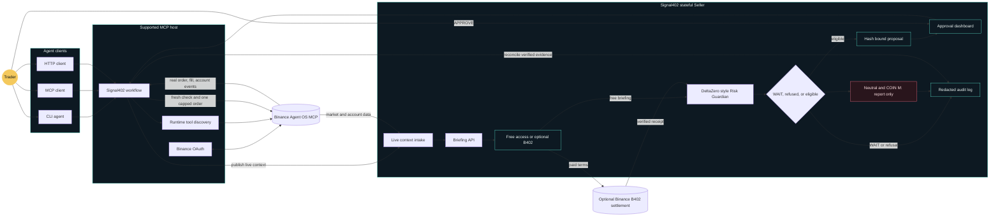
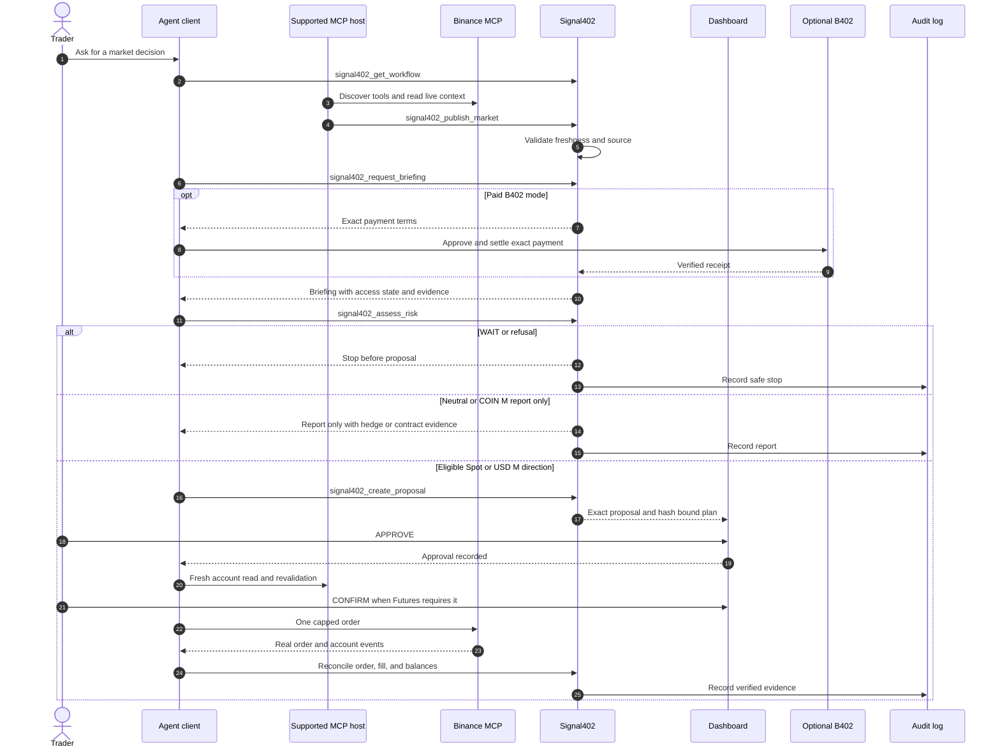

# Signal402 architecture

Signal402 connects an agent client to live Binance context, a deterministic risk gate, and a human controlled execution boundary. The supported MCP host owns Binance OAuth and runtime tool discovery. Signal402 owns the briefing, risk decision, proposal, approval state, and redacted audit trail.

## System architecture

## Agent sequence

## Trust boundary legend

| Boundary | Signal402 allows | Signal402 refuses |
| --- | --- | --- |
| Supported MCP host | OAuth, runtime discovery, live account reads, and order calls | Invented tool names and public REST account or order data |
| Signal402 Seller | Briefings, risk decisions, proposals, approvals, and redacted audit records | OAuth tokens, API keys, fake receipts, and fake fills |
| Binance Agentic Wallet | Exact B402 payment signing when paid mode is configured | Trade approval and Binance order submission |
| Dashboard | Human approval and confirmation for the exact proposal | Credentials, tokens, or client supplied status changes |
| Binance | Market data, account state, payment settlement, orders, and fills | A promise of profit or a guaranteed loss limit |

## Operating modes

| Mode | Output | Order writes |
| --- | --- | --- |
| Free Spot | Live briefing with no receipt | One capped order may proceed after every gate |
| Paid Spot | Briefing after real B402 settlement | One capped order may proceed after every gate |
| USD M directional | Futures risk envelope and proposal when eligible | One isolated order may proceed after approval and confirmation |
| Neutral Futures | Hedge ratio and risk evidence | Report only |
| COIN M Futures | Contract risk evidence | Report only |

No path grants withdrawal or transfer access. A risk estimate is not a guaranteed loss limit.
